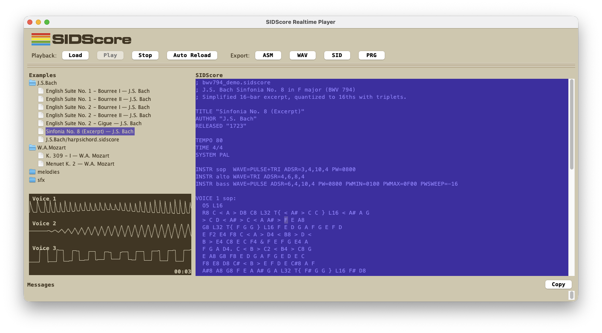

SIDScore is a Java/ANTLR-based DSL and toolchain for producing music and sound effects for the Commodore 64 SID. It lets you write scores, define instruments, audition them in a realtime player, and export to C64-ready formats.

### Design focus

- SRAP (SIDScore Realtime Audio Player) is the reference renderer. It's aim is to be able to play music true to the score. It has less focus on the more advanced features of the SID-chips, such as filters and tables.
- The built-in `sidscore` assembly backend ("SIDScore Driver") aims to reproduce SRAP behavior in exported `ASM/PRG/SID`.
- Driver backends are pluggable, so alternative exporters (for example reverse-engineered legacy drivers) can be added without changing the DSL or SRAP.

### What it includes

- A SID-aware DSL with instruments, tables/sequences, and reusable imports for instrument definitions.
- SRAP: a SID-oriented realtime renderer with 6581/8580 model support.
- A realtime player UI with editor, auto-reload, oscilloscope per voice, and example browser.
- Exporters that produce MOS6502 assembly + player (driver) code, plus `*.prg`, `*.sid`, and `.wav` output (via KickAssembler for PRG/SID).
- A pluggable driver backend layer (`--driver`) with built-in `sidscore` backend.
- A growing collection of examples (SFX and melodies), including pieces derived from MIDI and sheet music.

### Quick start

Build the module:

```sh
mvn -f net.resheim.sidscore/pom.xml -q package
```

Run the CLI from repo root (example file):

```sh
java -cp net.resheim.sidscore/bin/classes:net.resheim.sidscore/lib/antlr-runtime-4.13.1.jar \
  net.resheim.sidscore.SIDScoreCLI examples/test.sidscore
```

Use `--no-play` with `--wav`, `--asm`, `--prg`, or `--sid` to export without realtime audio.

List available driver backends:

```sh
java -cp net.resheim.sidscore/bin/classes:net.resheim.sidscore/lib/antlr-runtime-4.13.1.jar \
  net.resheim.sidscore.SIDScoreCLI --list-drivers
```

Select a backend explicitly (defaults to `sidscore`):

```sh
java -cp net.resheim.sidscore/bin/classes:net.resheim.sidscore/lib/antlr-runtime-4.13.1.jar \
  net.resheim.sidscore.SIDScoreCLI examples/test.sidscore --driver sidscore --sid out.sid --no-play
```

### Documentation

- [SIDScore_Language_Specification.md](SIDScore_Language_Specification.md) describes the language and instrument system in detail.

### SIDScore Realtime Audio Player (SRAP) UI

The GUI player lets you edit and audition scores interactively:

- Editor with auto-reload for fast iteration.
- Play/Stop controls plus a file loader.
- Playback renderer selector: `SRAP` (built-in realtime synth) or `VICE` (external `vsid` direct playback).
- Examples navigator that loads and plays on activation.
- Three voice oscilloscope views for quick feedback.
- `Messages` panel shows `vsid` output during VICE playback.



Start the realtime player after building the module:

```sh
java -cp net.resheim.sidscore/bin/classes:net.resheim.sidscore/lib/antlr-runtime-4.13.1.jar \
  net.resheim.sidscore.ui.RealtimeAudioPlayerUI
```

Run it from the repo root so the examples browser and banner image resolve correctly.

If `VICE` playback is selected, SIDScore uses `vsid` from `PATH` (or `SIDSCORE_VICE_BIN` if set) for direct audio playback.
Optional: set `SIDSCORE_VICE_DATA_DIR` to the VICE data directory if your installation needs explicit sysfile lookup.
By default, VICE logs are shown in full in `Messages`. To re-enable compact/suppressed log mode, start UI with `--compact-vice-log` (or set `SIDSCORE_VICE_COMPACT_LOG=1` / `-Dsidscore.vice.compactLog=true`). Use `--full-vice-log` to force full logs.


## Resources

- [The Sound Interface Device on C64 Wiki](https://www.c64-wiki.com/wiki/SID)
- [MUTOPIA Project – Free Sheet Music for Everyone](https://www.mutopiaproject.org/index.html)
- [How To Read Sheet Music: A Step-by-Step Guide](https://www.musicnotes.com/blog/how-to-read-sheet-music/)
